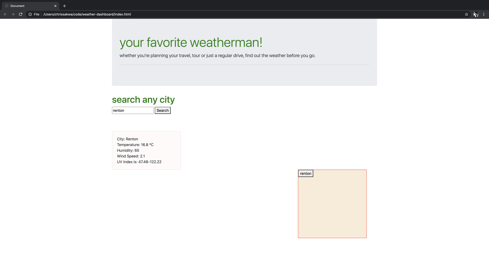

# weather-dashboard
This program displays the weather of a given city entered by a user. The information displayed includes temperature and humidity. 
# Technology Used
The technologies used in this program are HTML, CSS and Javascript.

# Screenshot of Homepage

# Author
Chris Sakwa Wesonga is a full stack web developer in Seattle, WA.
Github: github.com/ckomodo
Twitter: @slimsakwa